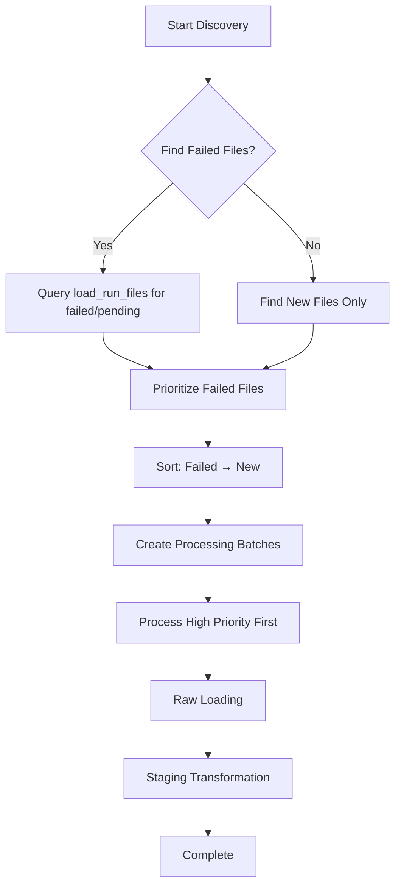

# ETL Reprocessing Strategies

## Overview

This document outlines the strategy for handling reprocessing of load runs and staging transforms in the Indici healthcare data ingestion pipeline. The approach prioritizes **staging tables containing only the latest loaded records** for optimal query performance and reporting, while maintaining appropriate audit trails and debugging capabilities.

## Current Architecture

### System Components
- **Discovery Service**: Identifies new/changed files in S3
- **Raw Loader**: Loads CSV files into `raw.*` tables with lineage tracking
- **Staging Transformer**: Transforms `raw.*` → `stg.*` tables with validation
- **Audit Tables**: `load_runs`, `load_run_files`, `staging_runs` for execution tracking

### Data Flow
```
S3 Files → [Raw Loader] → raw.* tables → [Staging Transformer] → stg.* tables → [Reporting]
                    ↑                           ↑
           Load Run Tracking             Staging Run Tracking
```

## Reprocessing Scenarios

### When Reprocessing Occurs

1. **Data Quality Issues**: Downstream processes reveal data problems requiring correction
2. **Schema Changes**: Updates to raw table schemas or transformation logic
3. **Bug Fixes**: Corrections to parsing logic, validation rules, or business logic
4. **Performance Optimization**: Adjustments to processing parameters (batch sizes, memory usage)
5. **Recovery Operations**: Recovery from partial or complete load failures
6. **Data Backfills**: Processing historical data for new extract types or date ranges

### Enhanced Discovery Strategy: Failed Files First

**Problem Addressed**: Processing new files while ignoring failed files creates data gaps and synchronization issues.

**Solution**: Enhanced **existing S3DiscoveryService** that prioritizes failed/unprocessed files over new files to maintain data consistency.

```typescript
// Enhanced S3DiscoveryService with failed file prioritization
export class S3DiscoveryService {
  // ... existing properties and constructor

  async discoverLatestFiles(options?: DiscoveryOptions): Promise<ProcessingPlan> {
    // Phase 1: Find and prioritize failed/unprocessed files
    const failedFiles = await this.findFailedFiles(options);

    // Phase 2: Find new files (existing logic)
    const newFiles = await this.findNewFiles(options);

    // Phase 3: Combine with priority (failed files first)
    const prioritizedFiles = [
      ...failedFiles.map(f => ({ ...f, priority: 'high', reason: 'failed' })),
      ...newFiles.map(f => ({ ...f, priority: 'normal', reason: 'new' }))
    ];

    // Phase 4: Group into batches maintaining priority order
    return this.createProcessingPlan(prioritizedFiles, options);
  }

  // NEW: Helper method for failed file detection
  private async findFailedFiles(options?: DiscoveryOptions): Promise<DiscoveredFile[]> {
    // Query load_run_files for failed/incomplete records
    const failedRecords = await db
      .select({
        s3Key: loadRunFiles.s3Key,
        s3VersionId: loadRunFiles.s3VersionId,
        fileHash: loadRunFiles.fileHash,
        extractType: loadRunFiles.extractType,
        dateExtracted: loadRunFiles.dateExtracted,
        perOrgId: loadRunFiles.perOrgId,
        practiceId: loadRunFiles.practiceId
      })
      .from(loadRunFiles)
      .where(inArray(loadRunFiles.status, ['failed', 'pending']))
      .where(options?.extractTypes ?
        inArray(loadRunFiles.extractType, options.extractTypes) : undefined)
      .limit(options?.maxFailedFiles || 100);

    // Convert to DiscoveredFile format (existing conversion logic)
    return failedRecords.map(record => ({
      s3Bucket: this.config.s3.bucket,
      s3Key: record.s3Key,
      s3VersionId: record.s3VersionId,
      fileHash: record.fileHash,
      parsed: {
        extractType: record.extractType,
        dateExtracted: record.dateExtracted,
        perOrgId: record.perOrgId,
        practiceId: record.practiceId
      }
    }));
  }

  // ... existing methods remain unchanged
}
```

### Load Run Lifecycle & Problem Detection

**Understanding the Load Run States:**
```typescript
// Normal successful load run
const loadRunId = await loadRunService.createRun({
  triggeredBy: 'scheduled',
  notes: 'Daily patient data load'
});
// Status: 'running' → 'completed'

// Failed load run
const failedLoadRunId = await loadRunService.createRun({
  triggeredBy: 'scheduled',
  notes: 'Daily patient data load'
});
// Status: 'running' → 'failed' (due to errors)
```

**Problem Detection Methods:**

1. **Failed Status Detection:**
```sql
-- Find load runs that failed
SELECT loadRunId, status, error, completedAt
FROM etl.load_runs
WHERE status = 'failed'
  AND startedAt > NOW() - INTERVAL '7 days'  -- Last 7 days
ORDER BY startedAt DESC;
```

2. **Incomplete Load Runs:**
```sql
-- Find load runs that started but never completed/failed
SELECT loadRunId, status, startedAt
FROM etl.load_runs
WHERE status = 'running'
  AND startedAt < NOW() - INTERVAL '2 hours'  -- Running too long
ORDER BY startedAt DESC;
```

3. **Data Quality Issues:**
```sql
-- Find load runs with high error rates
SELECT
  lr.loadRunId,
  lr.totalRowsIngested,
  lr.totalRowsRejected,
  (lr.totalRowsRejected::float / NULLIF(lr.totalRowsIngested, 0)) * 100 as error_rate
FROM etl.load_runs lr
WHERE lr.status = 'completed'
  AND lr.completedAt > NOW() - INTERVAL '1 day'
  AND (lr.totalRowsRejected::float / NULLIF(lr.totalRowsIngested, 0)) > 0.05  -- > 5% error rate
ORDER BY error_rate DESC;
```

### Reprocessing Triggers

- **Manual Trigger**: Explicit reprocessing requests via API/UI for known problematic load runs
- **Scheduled**: Automated reprocessing for specific scenarios (e.g., weekly data quality checks)
- **Event-Driven**: Triggered by detection of schema changes or data quality issues
- **Monitoring-Based**: Automated detection and reprocessing of failed/incomplete load runs

### Complete Reprocessing Workflow

```typescript
class LoadRunMonitor {
  // Phase 1: Detection
  async findProblematicLoadRuns(): Promise<string[]> {
    const problematicRuns: string[] = [];

    // Find explicitly failed runs
    const failedRuns = await this.findFailedLoadRuns();
    problematicRuns.push(...failedRuns);

    // Find stuck/incomplete runs
    const stuckRuns = await this.findStuckLoadRuns();
    problematicRuns.push(...stuckRuns);

    // Find runs with data quality issues
    const qualityIssueRuns = await this.findDataQualityIssues();
    problematicRuns.push(...qualityIssueRuns);

    return [...new Set(problematicRuns)]; // Remove duplicates
  }

  // Phase 2: Reprocessing
  async autoReprocessProblematicRuns(): Promise<void> {
    const problematicLoadRunIds = await this.findProblematicLoadRuns();

    for (const loadRunId of problematicLoadRunIds) {
      try {
        await reprocessingService.reprocessLoadRun(loadRunId, {
          reason: 'Automated quality control',
          reprocessRaw: true,
          keepRawHistory: true,
          requireApproval: false
        });
      } catch (error) {
        console.error(`Failed to auto-reprocess ${loadRunId}:`, error);
        // Continue with next load run
      }
    }
  }
}
```

  private async findFailedLoadRuns(): Promise<string[]> {
    const failedRuns = await db
      .select({ loadRunId: loadRuns.loadRunId })
      .from(loadRuns)
      .where(eq(loadRuns.status, 'failed'))
      .where(sql`${loadRuns.startedAt} > NOW() - INTERVAL '7 days'`);

    return failedRuns.map(r => r.loadRunId);
  }

  private async findStuckLoadRuns(): Promise<string[]> {
    const stuckRuns = await db
      .select({ loadRunId: loadRuns.loadRunId })
      .from(loadRuns)
      .where(eq(loadRuns.status, 'running'))
      .where(sql`${loadRuns.startedAt} < NOW() - INTERVAL '2 hours'`);

    return stuckRuns.map(r => r.loadRunId);
  }

  private async findDataQualityIssues(): Promise<string[]> {
    const qualityIssues = await db
      .select({ loadRunId: loadRuns.loadRunId })
      .from(loadRuns)
      .where(eq(loadRuns.status, 'completed'))
      .where(sql`${loadRuns.completedAt} > NOW() - INTERVAL '1 day'`)
      .where(sql`(totalRowsRejected::float / NULLIF(totalRowsIngested, 0)) > 0.05`);

    return qualityIssues.map(r => r.loadRunId);
  }
}

// Priority processing is handled within S3DiscoveryService.createProcessingPlan()
// The service will sort files by priority before creating batches

## Data Synchronization Strategy

### Enhanced Discovery: Failed Files First

**Problem Solved**: Processing new files while ignoring failed files creates data gaps and synchronization issues.

**Core Benefits**:

1. **Prevents Data Gaps**
```sql
-- Before: Missing data from failed runs
-- 2024-01-01: Load run failed (missing data)
-- 2024-01-02: New data processed (gap in 2024-01-01)

-- After: Complete data coverage
-- 2024-01-01: Failed run reprocessed first (data recovered)
-- 2024-01-02: New data processed (complete coverage)
```

2. **Maintains Referential Integrity**
- Failed patient records are processed before new appointments that reference them
- Failed provider records are processed before dependent data

3. **Business Continuity**
- Healthcare reporting has complete historical data
- Patient care decisions based on complete information
- Audit trails are maintained

### Priority Processing Flow



## Data Management Strategy

### Core Principles

1. **Staging Tables = Latest Data Only**: `stg.*` tables contain only current, valid records for optimal reporting performance
2. **Raw Tables = Debug History**: `raw.*` tables maintain historical data for troubleshooting and audit purposes
3. **Failed Files First**: Prioritize failed/unprocessed files over new files to prevent data gaps
4. **Audit Trail Preservation**: Complete lineage tracking maintained in audit tables
5. **Referential Integrity**: Foreign key relationships remain intact throughout reprocessing

### Staging Table Strategy: Delete & Replace

**For `stg.*` tables (reporting layer):**
- **Delete existing data** for the load run being reprocessed
- **Insert new transformed data** to replace it completely
- **Result**: Clean, current dataset optimized for queries

```sql
-- Delete existing staging data for load run
DELETE FROM stg.patients
WHERE loadRunFileId IN (
  SELECT loadRunFileId FROM etl.load_run_files
  WHERE loadRunId = 'load-run-to-reprocess'
);

-- Insert new data (handled by staging transformer)
INSERT INTO stg.patients (...) VALUES (...);
```

### Raw Table Strategy: Soft Delete with History

**For `raw.*` tables (debugging layer):**
- **Mark existing records as superseded** rather than deleting
- **Keep historical data** for troubleshooting and audit purposes
- **Allow debugging** of previous processing runs

```sql
-- Step 1: Mark existing raw records as superseded
UPDATE raw.patients
SET
  isSuperseded = true,
  supersededAt = NOW()
WHERE loadRunFileId IN (
  SELECT loadRunFileId FROM etl.load_run_files
  WHERE loadRunId = 'original-load-run-id'
);

-- Step 2: Reprocess files (creates new load_run_file_id records)
-- (Raw loader handles this, creating new records with isSuperseded = false)

-- Step 3: Update superseded records to point to their replacements
UPDATE raw.patients
SET supersededByLoadRunFileId = new_replacement.loadRunFileId
FROM (
  SELECT
    old.loadRunFileId as old_file_id,
    new.loadRunFileId as new_file_id
  FROM etl.load_run_files old
  JOIN etl.load_run_files new ON
    old.s3Key = new.s3Key
    AND old.s3VersionId = new.s3VersionId
    AND old.loadRunId = 'original-load-run-id'
    AND new.loadRunId = 'new-reprocess-load-run-id'
) new_replacement
WHERE raw.patients.loadRunFileId = new_replacement.old_file_id;
```

### Schema Extensions Required

#### Raw Tables Enhancement
```sql
ALTER TABLE raw.patients ADD COLUMN
  isSuperseded BOOLEAN DEFAULT false,
  supersededAt TIMESTAMP WITH TIME ZONE,
  supersededByLoadRunFileId INTEGER REFERENCES etl.load_run_files(loadRunFileId);

-- Add index for performance
CREATE INDEX idx_raw_patients_superseded ON raw.patients(isSuperseded);
CREATE INDEX idx_raw_patients_load_run_file ON raw.patients(loadRunFileId);
```

#### Staging Tables (Current State Maintained)
- No schema changes required for staging tables
- Existing `loadRunFileId` foreign key provides sufficient lineage tracking
- Current data will be completely replaced during reprocessing

## Implementation Details

### Reprocessing Service Architecture

```typescript
class ReprocessingService {
  async reprocessLoadRun(loadRunId: string, options: ReprocessOptions): Promise<ReprocessResult> {
    // 1. Validate reprocessing request
    await this.validateReprocessingRequest(loadRunId, options);

    // 2. Create new load run for tracking
    const newLoadRunId = await this.createReprocessLoadRun(loadRunId, options);

    // 3. Handle raw table reprocessing (if requested)
    if (options.reprocessRaw) {
      await this.reprocessRawData(loadRunId, newLoadRunId, options);
    }

    // 4. Handle staging table reprocessing (primary focus)
    await this.reprocessStagingData(loadRunId, newLoadRunId, options);

    // 5. Complete the reprocessing
    return { newLoadRunId, stagingResult, rawResult: options.reprocessRaw };
  }
}
```

### Configuration Options

```typescript
interface ReprocessOptions {
  // Core behavior
  reprocessRaw: boolean;           // Whether to reprocess raw data
  keepRawHistory: boolean;         // Whether to soft-delete or hard-delete raw records

  // Scope control
  extractTypes?: string[];         // Specific extract types to reprocess
  dateRange?: { from: Date; to: Date }; // Date range filter for files

  // Safety controls
  dryRun?: boolean;               // Preview mode without actual changes

  // Reason tracking
  reason: string;                 // Reason for reprocessing
  requestedBy: string;            // Who requested the reprocessing
}

interface DiscoveryOptions {
  // Existing options
  extractTypes?: string[];
  maxFiles?: number;
  dateRange?: { from: Date; to: Date };

  // Priority processing options
  prioritizeFailedFiles?: boolean; // Default: true - process failed files first
  maxFailedFiles?: number;         // Limit failed file processing (default: 100)
  failedFileAgeLimit?: number;     // Days - don't reprocess failures older than this (default: 30)
}
```

### Configuration Example

```typescript
const discoveryService = new S3DiscoveryService({
  s3: { bucket: "data-bucket", region: "us-east-1" },
  discovery: {
    prioritizeFailedFiles: true,    // Process failed files first
    maxFailedFiles: 100,           // Limit failed file processing
    failedFileAgeLimit: 30,        // Don't reprocess failures older than 30 days
    batchSize: 50,                 // Smaller batches for failed files
  },
  processing: {
    priorityExtracts: ["Patients", "Providers"], // Critical data types
  }
});

// Enhanced discovery with failed file prioritization
const plan = await discoveryService.discoverLatestFiles({
  extractTypes: ["Patients"],
  prioritizeFailedFiles: true,
  maxFailedFiles: 50,
  failedFileAgeLimit: 7  // Only recent failures
});
```

### Key Implementation Methods

```typescript
// Required imports for implementation
import { db } from "../../db/client";
import { loadRuns, loadRunFiles } from "../../db/schema/etl/audit";
import { patientsRaw } from "../../db/schema/raw/patients";
import { eq, inArray, sql } from "drizzle-orm";
```

#### 1. Staging Data Replacement
```typescript
private async reprocessStagingData(
  originalLoadRunId: string,
  newLoadRunId: string,
  options: ReprocessOptions
): Promise<StagingTransformResult> {

  // Delete existing staging data for this load run
  // Find all load_run_file_id records for the original load run
  const originalFileIds = await this.getLoadRunFileIds(originalLoadRunId);

  // Delete staging records linked to those file IDs
  await this.deleteStagingDataByFileIds(originalFileIds);

  // Transform new/updated raw data to staging
  const result = await stagingTransformer.transformLoadRun(newLoadRunId, {
    loadRunId: newLoadRunId,
    extractTypes: options.extractTypes,
    forceRefresh: true
  });

  return result;
}

private async getLoadRunFileIds(loadRunId: string): Promise<number[]> {
  const files = await db
    .select({ loadRunFileId: loadRunFiles.loadRunFileId })
    .from(loadRunFiles)
    .where(eq(loadRunFiles.loadRunId, loadRunId));

  return files.map(f => f.loadRunFileId);
}
```

#### 2. Raw Data Handling
```typescript
private async reprocessRawData(
  originalLoadRunId: string,
  newLoadRunId: string,
  options: ReprocessOptions
): Promise<RawLoadResult> {

  if (options.keepRawHistory) {
    // Soft delete: mark existing records as superseded
    const originalFileIds = await this.getLoadRunFileIds(originalLoadRunId);
    await this.markRawRecordsAsSuperseded(originalFileIds);

    // Load new raw data (creates new load_run_file_id records)
    const result = await rawLoader.loadFiles(files, newLoadRunId, {
      forceReprocess: true,
      extractTypes: options.extractTypes
    });

    // Link superseded records to their replacements
    await this.linkSupersededRecords(originalLoadRunId, newLoadRunId);

    return result;
  } else {
    // Hard delete: remove old raw records entirely
    await this.deleteRawDataByLoadRun(originalLoadRunId);

    // Load new raw data
    const result = await rawLoader.loadFiles(files, newLoadRunId, {
      forceReprocess: true,
      extractTypes: options.extractTypes
    });

    return result;
  }
}

private async markRawRecordsAsSuperseded(fileIds: number[]): Promise<void> {
  // Mark all raw records for these file IDs as superseded
  await db.update(patientsRaw)
    .set({
      isSuperseded: true,
      supersededAt: new Date()
    })
    .where(inArray(patientsRaw.loadRunFileId, fileIds));

  // Repeat for other raw tables as needed
}

private async linkSupersededRecords(
  originalLoadRunId: string,
  newLoadRunId: string
): Promise<void> {
  // Match old and new load_run_file_id records by S3 location
  const linkQuery = sql`
    UPDATE raw.patients
    SET supersededByLoadRunFileId = new_file.loadRunFileId
    FROM etl.load_run_files old_file,
         etl.load_run_files new_file
    WHERE raw.patients.loadRunFileId = old_file.loadRunFileId
      AND old_file.s3Key = new_file.s3Key
      AND old_file.s3VersionId = new_file.s3VersionId
      AND old_file.loadRunId = ${originalLoadRunId}
      AND new_file.loadRunId = ${newLoadRunId}
      AND raw.patients.isSuperseded = true
  `;

  await db.execute(linkQuery);
}
```

## Operational Procedures

### Pre-Reprocessing Checklist

1. **Assess Impact**: Determine scope of reprocessing (extract types, date ranges)
2. **Check Dependencies**: Identify downstream processes that will be affected
3. **Backup Strategy**: Ensure appropriate backup/archive procedures are in place
4. **Communication**: Notify stakeholders of planned reprocessing and expected downtime
5. **Rollback Plan**: Prepare rollback strategy in case of issues

### Reprocessing Workflow

#### Manual Reprocessing
```bash
# CLI command for reprocessing
pnpm etl reprocess --load-run-id <load-run-id> \
  --reason "Data quality fix" \
  --extract-types Patient Appointments \
  --keep-raw-history \
  --dry-run
```

#### Automated Reprocessing
```typescript
// Scheduled reprocessing for data quality checks
async function scheduledDataQualityReprocessing() {
  const problematicLoadRuns = await identifyProblematicLoadRuns();

  for (const loadRunId of problematicLoadRuns) {
    await reprocessingService.reprocessLoadRun(loadRunId, {
      reason: 'Automated data quality correction',
      reprocessRaw: true,
      keepRawHistory: true,
      requireApproval: false
    });
  }
}
```

### Rollback Procedures

#### Emergency Rollback
```typescript
async function rollbackReprocessing(newLoadRunId: string, reason: string) {
  // 1. Identify the original load run that was reprocessed
  const originalLoadRunId = await getOriginalLoadRunId(newLoadRunId);

  // 2. Restore from archive (if available)
  if (await archiveExists(originalLoadRunId)) {
    await restoreFromArchive(originalLoadRunId);
  } else {
    // 3. Alternative: Restore from superseded raw records
    await restoreFromSupersededRecords(originalLoadRunId);
  }

  // 4. Mark reprocessing run as failed
  await markLoadRunAsFailed(newLoadRunId, `Rolled back: ${reason}`);

  // 5. Notify stakeholders
  await sendRollbackNotification(originalLoadRunId, newLoadRunId, reason);
}
```

## Monitoring & Safety Measures

### Reprocessing Metrics

```typescript
interface ReprocessingMetrics {
  totalReprocessingRuns: number;
  averageReprocessingTime: number;
  successRate: number;
  dataVolumeProcessed: number;
  rollbackIncidents: number;

  byReason: Record<string, number>;
  byExtractType: Record<string, number>;
  byTimeOfDay: Record<string, number>;
}
```

### Safety Controls

1. **Dry Run Mode**: Preview reprocessing impact without making changes
2. **Circuit Breakers**: Automatic halting if error rates exceed thresholds
3. **Progress Tracking**: Basic monitoring of reprocessing progress
4. **Error Handling**: Proper error handling and rollback capabilities


## Implementation Phases

### Phase 1: Foundation (Week 1-2)
- [ ] Update schema with supersession fields for raw tables
- [ ] Implement basic `ReprocessingService` class
- [ ] Enhance discovery service with failed file detection
- [ ] Add configuration options and validation
- [ ] Create logging and monitoring infrastructure

### Phase 2: Enhanced Discovery & Priority Processing (Week 3-4)
- [ ] Enhance existing `S3DiscoveryService` with failed file prioritization
- [ ] Modify `discoverLatestFiles()` to prioritize failed files
- [ ] Implement staging table delete & replace logic
- [ ] Implement raw table soft delete logic
- [ ] Add file discovery and filtering for selective reprocessing
- [ ] Create CLI commands for manual reprocessing

### Phase 3: Safety & Monitoring (Week 5-6)
- [ ] Implement dry-run mode and impact analysis
- [ ] Add data synchronization monitoring
- [ ] Implement basic error handling and rollback capabilities

## Testing Strategy

### Essential Tests
- [ ] Test reprocessing service initialization and configuration
- [ ] Test enhanced discovery service with failed file prioritization
- [ ] Test staging data deletion and replacement logic
- [ ] Test raw data soft delete functionality
- [ ] Test end-to-end reprocessing workflow
- [ ] Test basic error handling and rollback capabilities

## Success Metrics

### Core Metrics
- **Reprocessing Success Rate**: Percentage of reprocessing operations that complete successfully
- **Failed File Recovery Rate**: Percentage of failed files successfully reprocessed
- **Data Synchronization Accuracy**: How effectively failed files are prioritized over new files
- **Query Performance Impact**: Effect on staging table query performance during reprocessing
- **Storage Growth Control**: Growth rate of raw table storage with soft deletes

### Operational Metrics
- **MTTR**: Mean time to recovery from failed reprocessing
- **Reprocessing Frequency**: How often reprocessing is required
- **Data Gap Reduction**: Reduction in data gaps due to failed file prioritization

## Summary

This strategy provides a solid foundation for reliable, efficient reprocessing while maintaining data quality and operational safety. The enhanced discovery strategy ensures failed files are prioritized to prevent data synchronization issues, while the simplified data management approach focuses on essential functionality for the initial implementation.
